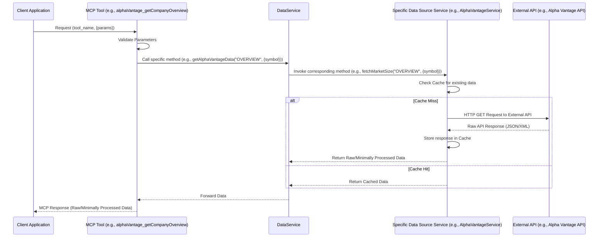
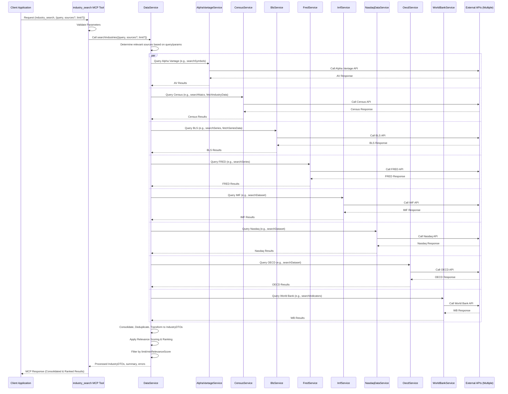
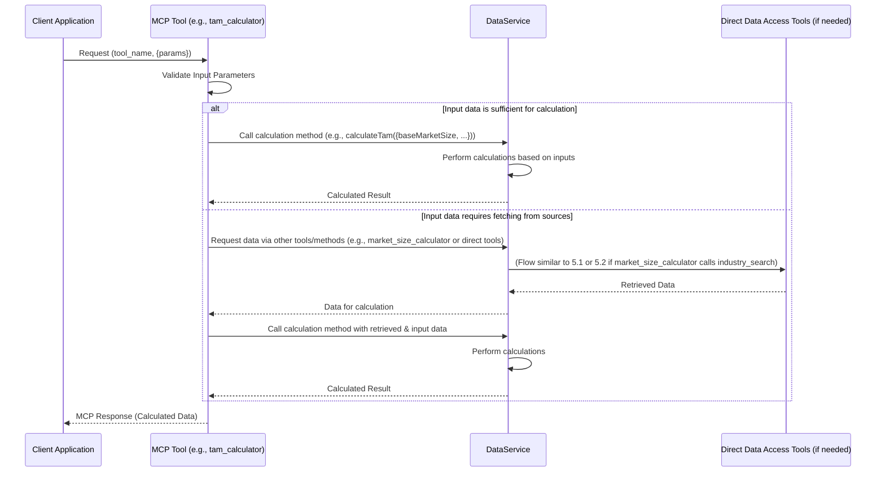

# TAM MCP Server - Design and Architecture

This document outlines the design and architecture of the Total Addressable Market (TAM) Market Context Protocol (MCP) Server and documents its current production-ready implementation status.

## 1. Introduction

The Total Addressable Market (TAM) Market Context Protocol (MCP) Server is a **production-ready** specialized backend service that provides comprehensive market and industry intelligence. The server successfully integrates 8 major data sources and implements a **dual tool system** providing both direct data access and advanced business analysis capabilities.

**Implementation Status: ✅ PRODUCTION READY**
- **Full Backend Integration**: All 8 data sources operational with API keys
- **Dual Tool Architecture**: 28 total MCP tools (17 data access + 11 business analysis tools)
- **Transport Support**: Both STDIO and HTTP Streaming protocols fully functional
- **Comprehensive Testing**: 100% tool functionality verified through automated testing
- **Enhanced User Experience**: Key tools include detailed help, examples, and enum guidance

**Dual Tool System Architecture (28 Total MCP Tools):**
*   **MCP Data Access Layer**: 17 tools comprising 13 raw data APIs and 4 basic market analysis tools
*   **Business Analysis Layer**: 11 conversational market intelligence tools for advanced analysis and business insights
*   **Unified Backend**: Single DataService orchestrates both tool systems with intelligent routing
*   **Flexible Integration**: Applications can use either tool system based on their needs

**Core Capabilities Achieved:**
*   **Unified Data Access:** Single, consistent MCP API accessing Alpha Vantage, BLS, Census Bureau, FRED, IMF, Nasdaq Data Link, OECD, and World Bank with intelligent routing and caching.
*   **Advanced Data Orchestration:** DataService layer provides intelligent source selection, cross-validation, and direct data access capabilities for maximum flexibility.
*   **Dual Tool Architecture:** 28 MCP tools total - 17 data access tools (13 raw data APIs + 4 basic market analysis) + 11 conversational business analysis tools with enhanced user guidance.
*   **Enhanced User Experience:** Business analysis tools feature comprehensive help information, practical examples, and detailed parameter guidance.
*   **Production Architecture:** Robust error handling, multi-layer caching, rate limiting, structured logging, and enterprise-ready security features.
*   **Protocol Compliance:** Full MCP 2024-11-05 specification support with tools, resources, logging, and notifications capabilities.

This document details the server's current architecture, implemented dual tool system, operational status, and the comprehensive enhancements that have been completed.

## 1.1. Current Implementation Status

**✅ PRODUCTION READY - Dual Tool System Complete**

The TAM MCP Server has achieved complete production readiness with a sophisticated dual tool architecture:

### Tool System Architecture

**System 1: MCP Data Access Tools (17 tools)**
- **Purpose**: Direct access to data sources with basic market analysis
- **Usage**: Applications needing raw data from specific sources
- **Definition**: Implemented in `src/tools/tool-definitions.ts`
- **Access**: Available via MCP protocol for data source integration

**System 2: Business Analysis Tools (11 tools)**  
- **Purpose**: Advanced market analysis and business intelligence
- **Usage**: Business analysts, market researchers, investment teams
- **Definition**: Implemented in `src/tools/market-tools.ts`
- **Access**: Available via MCP protocol for analytical workflows

### Backend Integration Status
- **✅ Alpha Vantage**: Company overviews, symbol search, financial statements - API key integrated
- **✅ Bureau of Labor Statistics (BLS)**: Employment data series access - API key integrated
- **✅ U.S. Census Bureau**: Industry statistics and market size data - API key integrated
- **✅ Federal Reserve Economic Data (FRED)**: Economic series observations - API key integrated
- **✅ International Monetary Fund (IMF)**: SDMX-JSON datasets and observations - Public API access
- **✅ Nasdaq Data Link**: Time series and latest dataset values - API key integrated
- **✅ OECD**: SDMX-JSON economic datasets - Public API access
- **✅ World Bank**: Economic indicators by country - Public API access

### Tool Implementation Status

**MCP Data Access Tools: 17 tools (Direct data source access + basic market analysis)**
Located in `src/tools/tool-definitions.ts`:

**Direct Data Source Access (13 tools):**
- `alphaVantage_getCompanyOverview` ✅
- `alphaVantage_searchSymbols` ✅
- `bls_getSeriesData` ✅
- `census_fetchIndustryData` ✅
- `census_fetchMarketSize` ✅
- `fred_getSeriesObservations` ✅
- `imf_getDataset` ✅
- `imf_getLatestObservation` ✅
- `nasdaq_getDatasetTimeSeries` ✅
- `nasdaq_getLatestDatasetValue` ✅
- `oecd_getDataset` ✅
- `oecd_getLatestObservation` ✅
- `worldBank_getIndicatorData` ✅

**Basic Market Analysis (4 tools):**
- `industry_search` ✅
- `tam_calculator` ✅ (Enhanced with comprehensive help and examples)
- `market_size_calculator` ✅ (Enhanced with methodology guidance)
- `company_financials_retriever` ✅ (Enhanced with statement type explanations)

**Business Analysis Tools: 11 tools (Advanced market intelligence)**
Located in `src/tools/market-tools.ts`, integrated via `src/tools/tool-definitions.ts`:

1. `industry_analysis` ✅ (Enhanced multi-source industry analysis - renamed from industry_search for clarity)
2. `industry_data` ✅ (Detailed industry intelligence with trends, ESG, players)
3. `market_size` ✅ (Market size estimation and analysis)
4. `tam_analysis` ✅ (Advanced Total Addressable Market calculations - renamed from tam_calculator for clarity)
5. `sam_calculator` ✅ (Serviceable Addressable Market with constraints)
6. `market_segments` ✅ (Hierarchical market segmentation analysis)
7. `market_forecasting` ✅ (Time series forecasting with scenarios)
8. `market_comparison` ✅ (Multi-market comparative analysis)
9. `data_validation` ✅ (Cross-source data quality validation)
10. `market_opportunities` ✅ (Market gap and opportunity identification)
11. `generic_data_query` ✅ (Direct data source service access)

### Enhancement Status
**User Experience Improvements Completed:**
- **🎯 Enhanced Tool Descriptions**: Three key analytical tools feature 1000+ character comprehensive descriptions with practical examples, use cases, and parameter guidance
- **📋 Enum Value Explanations**: All enum parameters include clear explanations and usage contexts
- **💡 Pro Tips**: Professional usage recommendations and popular examples (e.g., stock symbols, geography codes)
- **🔍 Methodology Guidance**: Clear explanations of calculation approaches and when to use each

### Testing & Validation Status

- **✅ 100% Tool Functionality**: All 28 tools verified through MCP protocol
- **✅ Backend Integration**: Real API calls successfully executed across all 8 data sources
- **✅ Transport Support**: Both STDIO and HTTP Streaming protocols operational
- **✅ MCP Compliance**: Full 2024-11-05 specification support verified
- **✅ Error Handling**: Robust fallback mechanisms and informative error responses
- **✅ Performance**: Multi-layer caching and rate limiting operational
- **✅ API Testing**: Comprehensive Postman collection verified with 95.7% success rate (22/23 tests passing)

### API Testing & Integration Verification

**Postman Collection Status: ✅ Production Ready**
- **Collection Location**: `examples/TAM-MCP-Server-Postman-Collection.json`
- **Test Coverage**: Complete MCP functionality (Tools, Resources, Prompts, Core MCP)
- **Success Rate**: 95.7% (22/23 endpoints verified)
- **Test Report**: See `doc/reports/POSTMAN-COLLECTION-VERIFICATION-REPORT.md`

**Verified API Endpoints:**
- **Core MCP**: Health check, session initialization, session termination
- **Tools**: All 11 business analysis tools + comprehensive parameter validation
- **Resources**: Documentation resources (README, Contributing, Release Notes)
- **Prompts**: Business analysis prompt generation (startup funding, private equity, corporate strategy)

**Testing Methodology:**
- **Newman Integration**: Automated testing via Newman CLI for CI/CD
- **Session Management**: Proper MCP session lifecycle testing
- **Response Validation**: JSON-RPC compliance and content verification
- **Error Handling**: Invalid requests and edge case testing

### Architecture Status
- **✅ DataService Orchestration**: Intelligent routing and direct data access capabilities
- **✅ Tool Definitions**: JSON Schema format with enhanced descriptions and examples
- **✅ Caching Layer**: NodeCache-based in-memory caching with Redis/hybrid options for production
- **✅ Logging System**: Structured Winston logging with business metrics
- **✅ Security**: Input validation, rate limiting, and API key management
- **✅ Documentation**: Comprehensive guides, API documentation, and usage examples

## 1.2. Dual Tool System Architecture

The TAM MCP Server implements a sophisticated **dual tool system** to serve different use cases and user types:

### System 1: MCP Data Access Tools
**File**: `src/tools/tool-definitions.ts`  
**Count**: 17 tools  
**Purpose**: Direct data source access with basic market analysis

**Target Users:**
- Application developers
- Data engineers
- Systems requiring raw data
- Custom analytics builders

**Tool Categories:**
- **Direct Data Source Access (13 tools)**: Raw data from specific sources
- **Basic Market Tools (4 tools)**: Essential market analysis tools including `industry_search` and `tam_calculator`

**Usage Pattern:**
```typescript
// Example: Direct Alpha Vantage company data
await client.callTool("alphaVantage_getCompanyOverview", { symbol: "AAPL" });

// Example: Basic industry search from data sources
await client.callTool("industry_search", { query: "tech software" });
```

### System 2: Business Analysis Tools
**File**: `src/tools/market-tools.ts`  
**Count**: 11 tools  
**Purpose**: Advanced market intelligence and business analysis

**Target Users:**
- Business analysts
- Market researchers
- Investment teams
- Strategic planners

**Tool Categories:**
- **Industry Intelligence**: Detailed industry data with trends and ESG including `industry_analysis` (enhanced multi-source analysis)
- **Market Analysis**: TAM/SAM calculations and size estimation including `tam_analysis` (advanced TAM calculations)
- **Comparative Analysis**: Market comparison and forecasting
- **Data Quality**: Validation and opportunity identification

**Usage Pattern:**
```typescript
// Example: Business analyst market research
await client.callTool("industry_data", { 
  industry_id: "tech-software", 
  include_trends: true, 
  include_esg: true 
});

// Example: Enhanced industry analysis with comprehensive insights
await client.callTool("industry_analysis", { query: "fintech", include_esg: true });
```

### Tool Naming Convention
To ensure clarity and avoid confusion, similar tools in both systems have been given distinct names:

**Data Access vs Business Analysis:**
- `industry_search` (basic data source search) vs `industry_analysis` (enhanced multi-source analysis)
- `tam_calculator` (basic TAM calculation) vs `tam_analysis` (advanced TAM with scenarios)

This naming convention allows users to clearly distinguish between basic data access tools and advanced business intelligence tools while maintaining backward compatibility.

### Unified Backend Architecture
Both tool systems share the same backend infrastructure:

1. **DataService Layer**: Single orchestration layer serving both tool systems
2. **Data Source Integration**: All 8 sources accessible by both systems
3. **Caching Strategy**: Shared caching layer optimized for both use cases
4. **Error Handling**: Consistent error responses across both systems
5. **MCP Protocol**: Both systems fully compliant with MCP 2024-11-05 specification

### Tool System Selection Guide

**Use MCP Data Access Tools when:**
- You need raw data from specific sources
- Building custom analytics or visualizations
- Integrating data into existing systems
- Requiring maximum flexibility in data processing

**Use Business Analysis Tools when:**
- Performing market research and analysis
- Need processed insights and intelligence
- Creating business reports and presentations
- Requiring guided analysis with built-in expertise

## 2. Tool Catalog and Architecture
This section details the available MCP tools, categorized by their function.

### 2.1. Direct Data Source Access Tools
These tools provide direct access to specific data from the integrated live data sources. They are designed to return raw or minimally processed data from a single source per call, without cross-source consolidation. This allows for granular data retrieval.

#### 2.1.1. Alpha Vantage
*   **`alphaVantage_getCompanyOverview`**
    *   Description: Retrieves company overview and key financial ratios for a given stock symbol.
    *   Backend Service Method: `AlphaVantageService.fetchMarketSize` (with `function=OVERVIEW`)
    *   Input Parameters: `symbol: string`
    *   Output: Raw JSON data from Alpha Vantage API (Company Overview).
    *   Tool Logic: Directly calls `DataService.getAlphaVantageData("OVERVIEW", { symbol })`. Returns the raw, unprocessed JSON response.
*   **`alphaVantage_searchSymbols`**
    *   Description: Searches for stock symbols and company names matching keywords using Alpha Vantage.
    *   Backend Service Method: `AlphaVantageService.searchSymbols`
    *   Input Parameters: `keywords: string`
    *   Output: Raw JSON data from Alpha Vantage API (Symbol Search).
    *   Tool Logic: Directly calls `DataService.getAlphaVantageData("SYMBOL_SEARCH", { keywords })`. Returns the raw, unprocessed JSON response.

#### 2.1.2. Bureau of Labor Statistics (BLS)
*   **`bls_getSeriesData`**
    *   Description: Retrieves data for one or more BLS series IDs.
    *   Backend Service Method: `BlsService.fetchSeriesData`
    *   Input Parameters: `seriesIds: string[]`, `startYear?: string`, `endYear?: string`, `catalog?: boolean`, `calculations?: boolean`, `annualaverage?: boolean`, `aspects?: string[]`
    *   Output: Raw JSON data from BLS API for the specified series.
    *   Tool Logic: Directly calls `DataService.getBlsSeriesData({ seriesid: seriesIds, startyear, endyear, catalog, calculations, annualaverage, aspects })`. Returns the raw, unprocessed JSON response.

#### 2.1.3. U.S. Census Bureau
*   **`census_fetchIndustryData`**
    *   Description: Fetches data from the Census Bureau (e.g., County Business Patterns) based on specified variables, geography, filters, year, and dataset path.
    *   Backend Service Method: `CensusService.fetchIndustryData`
    *   Input Parameters:
        *   `variables: string[] | string` - Comma-separated string or array of variable names (e.g., "EMP,PAYANN,ESTAB").
        *   `forGeography: string` - Geography parameter (e.g., "us:1", "state:01").
        *   `filterParams?: object` - Additional filters like NAICS2017, SIC (e.g., `{ "NAICS2017": "23" }`).
        *   `year?: string` - Data year (defaults to a configured or recent year).
        *   `datasetPath?: string` - Specific dataset path (e.g., "cbp" for County Business Patterns).
    *   Output: Raw JSON array from Census API, where each object represents a data record.
    *   Tool Logic: Directly calls `DataService.getCensusData("fetchIndustryData", { variables, forGeography, filterParams, year, datasetPath })`. Returns the raw, unprocessed JSON response.
*   **`census_fetchMarketSize`**
    *   Description: Fetches a specific measure (Employment, Annual Payroll, or Establishments) for an industry (NAICS) and geography from the Census Bureau.
    *   Backend Service Method: `CensusService.fetchMarketSize`
    *   Input Parameters:
        *   `naicsCode: string` - Industry code (e.g., "23" for Construction).
        *   `geography: string` - Geography parameter (e.g., "us:1").
        *   `measure?: "EMP" | "PAYANN" | "ESTAB"` - Measure to fetch (defaults to "EMP").
        *   `year?: string` - Data year (defaults to a configured or recent year).
    *   Output: Raw JSON object from Census API representing the specific market size data point.
    *   Tool Logic: Directly calls `DataService.getCensusData("fetchMarketSize", { naicsCode, geography, measure, year })`. Returns the raw, unprocessed JSON response.

#### 2.1.4. Federal Reserve Economic Data (FRED)
*   **`fred_getSeriesObservations`**
    *   Description: Fetches observations for a given FRED series ID.
    *   Backend Service Method: `FredService.fetchMarketSize` (Note: FRED service's `fetchMarketSize` is used for fetching series observations; `fetchIndustryData` is a placeholder).
    *   Input Parameters: `seriesId: string`
    *   Output: Raw JSON data from FRED API containing observations for the series.
    *   Tool Logic: Directly calls `DataService.getFredData({ seriesId })`. Returns the raw, unprocessed JSON response. (The `DataService` method would internally call `FredService.fetchMarketSize`).

#### 2.1.5. International Monetary Fund (IMF)
*   **`imf_getDataset`**
    *   Description: Fetches a dataset from IMF SDMX-JSON API based on dataflow ID, a structured key, and optional date range.
    *   Backend Service Method: `ImfService.fetchImfDataset` (or its alias `ImfService.fetchIndustryData`)
    *   Input Parameters:
        *   `dataflowId: string` - Identifier of the dataflow (e.g., "IFS").
        *   `key: string` - Dimension filter key (e.g., "A.US.NGDP_RPCH").
        *   `startPeriod?: string` - Optional start period (e.g., "2020").
        *   `endPeriod?: string` - Optional end period.
    *   Output: Raw JSON array from IMF API, where each object represents a flattened observation.
    *   Tool Logic: Directly calls `DataService.getImfData("fetchImfDataset", { dataflowId, key, startPeriod, endPeriod })`. Returns the raw, unprocessed JSON response.
*   **`imf_getLatestObservation`**
    *   Description: Fetches a dataset from IMF and returns the latest observation, typically used for a single market size value.
    *   Backend Service Method: `ImfService.fetchMarketSize`
    *   Input Parameters:
        *   `dataflowId: string` - Identifier of the dataflow.
        *   `key: string` - Dimension filter key.
        *   `startPeriod?: string` - Optional start period.
        *   `endPeriod?: string` - Optional end period.
        *   `valueAttribute?: string` - Optional: specific attribute to consider as the value (defaults to 'value').
    *   Output: Raw JSON object from IMF API representing the latest observation.
    *   Tool Logic: Directly calls `DataService.getImfData("fetchMarketSize", { dataflowId, key, startPeriod, endPeriod, valueAttribute })`. Returns the raw, unprocessed JSON response.


#### 2.1.6. Nasdaq Data Link
*   **`nasdaq_getDatasetTimeSeries`**
    *   Description: Fetches a time series dataset from Nasdaq Data Link.
    *   Backend Service Method: `NasdaqDataService.fetchIndustryData` (which internally calls `fetchDatasetTimeSeries`)
    *   Input Parameters:
        *   `databaseCode: string` - Database code (e.g., "FRED").
        *   `datasetCode: string` - Dataset code (e.g., "GDP").
        *   `params?: object` - Optional API parameters like `limit`, `start_date`, `end_date`, `order`, `column_index`.
    *   Output: Raw JSON array from Nasdaq Data Link API, where each object represents a data point in the time series.
    *   Tool Logic: Directly calls `DataService.getNasdaqData("fetchIndustryData", { databaseCode, datasetCode, params })`. Returns the raw, unprocessed JSON response.
*   **`nasdaq_getLatestDatasetValue`**
    *   Description: Fetches a dataset from Nasdaq Data Link and extracts a single value, typically the latest or for a specific date.
    *   Backend Service Method: `NasdaqDataService.fetchMarketSize`
    *   Input Parameters:
        *   `databaseCode: string` - Database code.
        *   `datasetCode: string` - Dataset code.
        *   `valueColumn?: string` - Optional: the name of the column containing the value.
        *   `date?: string` - Optional: specific date (YYYY-MM-DD) to find the value for. If not provided, latest is used.
    *   Output: Raw JSON object from Nasdaq Data Link API representing the specific data point.
    *   Tool Logic: Directly calls `DataService.getNasdaqData("fetchMarketSize", { databaseCode, datasetCode, valueColumn, date })`. Returns the raw, unprocessed JSON response.

#### 2.1.7. Organisation for Economic Co-operation and Development (OECD)
*   **`oecd_getDataset`**
    *   Description: Fetches a dataset from OECD SDMX-JSON API.
    *   Backend Service Method: `OecdService.fetchOecdDataset` (or its alias `OecdService.fetchIndustryData`)
    *   Input Parameters:
        *   `datasetId: string` - Identifier of the dataset (e.g., "QNA").
        *   `filterExpression: string` - Dimension filter (e.g., "AUS.TOTAL.AGR.Q").
        *   `agencyId?: string` - Agency identifier (defaults to 'all').
        *   `startTime?: string` - Start period (e.g., "2020", "2020-Q1").
        *   `endTime?: string` - End period.
        *   `dimensionAtObservation?: string` - How dimensions are reported (defaults to 'AllDimensions').
    *   Output: Raw JSON array from OECD API, where each object represents a flattened observation.
    *   Tool Logic: Directly calls `DataService.getOecdData("fetchOecdDataset", { datasetId, filterExpression, agencyId, startTime, endTime, dimensionAtObservation })`. Returns the raw, unprocessed JSON response.
*   **`oecd_getLatestObservation`**
    *   Description: Fetches an OECD dataset and returns the latest observation.
    *   Backend Service Method: `OecdService.fetchMarketSize`
    *   Input Parameters:
        *   `datasetId: string` - Identifier of the dataset.
        *   `filterExpression: string` - Dimension filter.
        *   `valueAttribute?: string` - Optional: specific attribute to consider as the value (defaults to 'value').
        *   `agencyId?: string` - Agency identifier.
        *   `startTime?: string` - Start period.
        *   `endTime?: string` - End period.
        *   `dimensionAtObservation?: string` - How dimensions are reported.
    *   Output: Raw JSON object from OECD API representing the latest observation.
    *   Tool Logic: Directly calls `DataService.getOecdData("fetchMarketSize", { datasetId, filterExpression, valueAttribute, agencyId, startTime, endTime, dimensionAtObservation })`. Returns the raw, unprocessed JSON response.

#### 2.1.8. World Bank
*   **`worldBank_getIndicatorData`**
    *   Description: Fetches data for a specific indicator and country from the World Bank.
    *   Backend Service Method: `WorldBankService.fetchMarketSize` (Note: World Bank service's `fetchMarketSize` is used for fetching indicator data; `fetchIndustryData` is a placeholder).
    *   Input Parameters:
        *   `countryCode: string` - Country code (e.g., "USA", "BRA").
        *   `indicator?: string` - World Bank indicator code (e.g., "NY.GDP.MKTP.CD"). Defaults to a configured GDP indicator.
    *   Output: Raw JSON data from World Bank API for the indicator and country.
    *   Tool Logic: Directly calls `DataService.getWorldBankData({ countryCode, indicator })`. Returns the raw, unprocessed JSON response. (The `DataService` method would internally call `WorldBankService.fetchMarketSize`).

### 2.2. Multi-Source Search and Aggregation Tools
These tools query multiple data sources, then consolidate, deduplicate, and rank the results to provide a comprehensive view.

#### 2.2.1. Industry Analysis (`industry_analysis`)
*   **Description:** Enhanced industry search and analysis across multiple integrated data sources using intelligent query processing. It provides comprehensive industry insights including market trends, key players, ESG factors, and cross-referenced data from multiple sources with sophisticated ranking and deduplication.
*   **Input Parameters:**
    *   `query`: string - The search query (e.g., "pharmaceutical manufacturing", "NAICS 3254", "biotechnology US", "economic outlook for renewable energy").
    *   `sources?`: string[] (optional) - Array of specific data source IDs (e.g., `["CENSUS", "BLS", "WORLD_BANK"]`) to restrict the search. If omitted, queries all enabled and relevant sources.
    *   `limit?`: number (optional) - Maximum number of consolidated industry results to return.
    *   `minRelevanceScore?`: number (optional, 0.0 to 1.0) - Minimum relevance score for results to be included.
    *   `geographyFilter?`: string[] (optional) - Array of geographic identifiers (e.g., ["US", "CA", "DE"]) to help focus the search, where applicable to underlying sources.
*   **Output:** JSON object containing:
    *   `query`: string - The original query string submitted.
    *   `parameters`: object - The parameters used for the search (including defaults if not specified).
    *   `results`: array of `IndustryDTO` objects. Each `IndustryDTO` represents a consolidated view of an industry and includes:
        *   `industryId`: string - A unique identifier for the industry (e.g., a primary NAICS code, or an internally generated ID for aggregated concepts).
        *   `name`: string - Common or standardized name of the industry.
        *   `description?`: string - A brief description or summary of the industry.
        *   `naicsCodes?`: string[] - Associated NAICS codes relevant to this industry entry.
        *   `sicCodes?`: string[] - Associated SIC codes, if available.
        *   `otherCodes?`: object[] - Other relevant industry classification codes (e.g., `{ "system": "ISIC", "code": "C2100" }`).
        *   `keywords?`: string[] - Relevant keywords or search terms associated with the industry.
        *   `marketSizeEstimate?`: object - An estimated market size, potentially aggregated or selected from the best available source. Structure: `{ "value": number, "currency": string, "year": string, "sourceExcerpt": string, "originalSource": string }`.
        *   `growthRate?`: object - Estimated growth rate. Structure: `{ "value": number, "period": "annual" | "quarterly", "year": string, "sourceExcerpt": string, "originalSource": string }`.
        *   `keyPlayers?`: string[] - List of key companies or entities in the industry.
        *   `trends?`: string[] - Notable trends observed in the industry.
        *   `dataSources`: array of objects - Details of the underlying data points from various sources that contributed to this consolidated DTO. Each object might include: `{ "sourceName": string, "sourceSpecificId": string, "dataType": string, "retrievedData": object, "retrievalTimestamp": string }`.
        *   `relevanceScore`: number - A score (e.g., 0.0 to 1.0) indicating the relevance of this consolidated entry to the original query.
        *   `lastUpdated?`: string (ISO 8601 date) - The most recent date an underlying data point for this entry was updated or reported by its source.
    *   `summary?`: string - An optional, brief textual summary of the overall findings or the top results.
    *   `errors?`: array of objects - Any errors encountered from specific data sources during the search process (e.g., `{ "sourceName": "AlphaVantage", "errorCode": "API_TIMEOUT", "message": "..." }`).
*   **Logic:**
    1.  Validates input parameters (`query`, `sources`, `limit`, `minRelevanceScore`, `geographyFilter`).
    2.  Calls `DataService.searchIndustries()` with the validated parameters. This is the core method responsible for orchestration.
    3.  The `DataService.searchIndustries()` method performs the following:
        *   **Multi-Source Search Strategy:** Concurrently queries enabled and relevant data sources (Alpha Vantage, Census, FRED, World Bank, BLS, Nasdaq, OECD, IMF, and potentially mock/static data providers). The selection of sources can be guided by the `sources` parameter or an internal logic that maps query types/keywords to appropriate data providers. Each data source service has specific query mapping logic (e.g., interpreting the main `query` for NAICS codes for Census, keywords for BLS, stock symbols/company names for Alpha Vantage, economic indicators for FRED/World Bank, etc.). The `geographyFilter` is used to refine queries to individual data sources where applicable.
        *   **Data Consolidation & Deduplication:** Results from various sources are transformed into a common `Industry` Data Transfer Object (DTO) schema. Sophisticated deduplication logic is applied based on NAICS codes, industry names, geographic scope, and other identifying factors to avoid redundant entries and to merge information about the same conceptual industry from different sources into a single, richer DTO.
        *   **Relevance Scoring and Ranking:** Consolidated `IndustryDTOs` are scored based on factors suchas: direct keyword matches in names or descriptions, the specificity of NAICS/other code matches, the completeness and quality of the data returned for an industry, the perceived reliability or directness of the data source for the query type, and the recency of the data. Results are then ranked by this relevance score.
        *   **Result Filtering & Limiting:** Applies the `limit` and `minRelevanceScore` parameters to the ranked list of results.
        *   **Fallback Mechanisms & Error Handling:** If live data sources fail, time out, or return no data, the system logs these errors (to be included in the tool's output). The search attempts to continue with other available sources. Caching is employed at both the `DataService` level (for potentially aggregated/transformed results) and at individual data source service levels (for raw API responses) to improve performance, reduce load on external APIs, and provide resilience. Mock data might be used as a fallback for certain queries if configured and primary sources are unavailable.
    4.  The `industry_search` tool receives the processed list of `IndustryDTOs`, summary, and error list from `DataService`.
    5.  Formats the final JSON response as specified in the "Output" section.

### 2.3. Analytical and Calculation Tools
The analytical tools leverage the integrated data sources to perform sophisticated market analysis, calculations, and projections. These tools have been enhanced with comprehensive help information, practical examples, and detailed parameter guidance to improve user experience.

#### 2.3.1. TAM Calculator (`tam_calculator`) - **✨ ENHANCED**
*   **Description**: Calculates Total Addressable Market (TAM) with comprehensive guidance and examples.
*   **Enhanced Features**: 
    - 📊 Projects market value over multiple years using compound growth
    - 💡 Use cases: startup funding presentations, market entry strategy, product roadmap planning
    - 📋 Detailed parameter guidance with specific examples (e.g., 0.20 for 20% growth)
    - 🎯 Real-world example: $500M SaaS market growing 20% annually over 5 years with 60% addressable portion
*   **Backend Service Method**: `DataService.calculateTam` or direct calculation using market size data
*   **Input Parameters**: 
    - `baseMarketSize: number` - Current market value in USD (e.g., 1000000000 for $1B)
    - `annualGrowthRate: number` - Growth rate as decimal (e.g., 0.15 = 15% annual growth)
    - `projectionYears: number` - Years to project (typically 3-10 years)
    - `segmentationAdjustments?: object` - Optional market focus factor (e.g., 0.8 = 80% of total market)
*   **Output**: JSON object with calculated TAM, year-by-year projections, and key assumptions
*   **Tool Logic**: Performs compound growth calculations, applies segmentation adjustments, provides detailed breakdown with confidence indicators.

#### 2.3.2. Market Size Calculator (`market_size_calculator`) - **✨ ENHANCED**
*   **Description**: Estimates current market size for an industry or product with methodology explanations and examples.
*   **Enhanced Features**:
    - 🔍 Searches across multiple data sources for market size data
    - 💼 Use cases: market research, investment thesis validation, business case development
    - 🎯 Methodology options with clear explanations: top_down, bottom_up, auto
    - 🌍 Common geography code examples: US, EU, APAC, CA, GB, DE, FR, JP, AU, etc.
    - 📊 Industry query examples: "Cloud infrastructure services", "Electric vehicle manufacturing"
*   **Backend Service Method**: `DataService.calculateMarketSize` with multi-source aggregation
*   **Input Parameters**:
    - `industryQuery: string` - Descriptive industry name or specific focus area
    - `geographyCodes?: string[]` - Geographic scope (e.g., ["US", "CA", "EU", "APAC", "Global"])
    - `indicatorCodes?: string[]` - Economic indicators to prioritize (optional)
    - `year?: string` - Target year for estimates (defaults to current)
    - `methodology?: "top_down" | "bottom_up" | "auto"` - Calculation approach
*   **Output**: JSON object with estimated market size, confidence score, data sources used, and methodology applied
*   **Tool Logic**: Multi-source data aggregation, methodology selection, confidence scoring with transparent source attribution.

#### 2.3.3. Company Financials Retriever (`company_financials_retriever`) - **✨ ENHANCED**
*   **Description**: Retrieves detailed financial statements for public companies with comprehensive guidance.
*   **Enhanced Features**:
    - 📈 Fetches comprehensive financial data from Alpha Vantage
    - 🏢 Use cases: investment research, competitive benchmarking, financial modeling, credit analysis
    - 💰 Statement type explanations: OVERVIEW (company metrics), INCOME_STATEMENT (revenue/profit), BALANCE_SHEET (assets/liabilities), CASH_FLOW (cash movements)
    - 📅 Period guidance: annual (recommended for trends) vs quarterly (recent performance)
    - 💡 Pro tips: popular symbols (AAPL, MSFT, GOOGL, AMZN, TSLA), usage recommendations
*   **Backend Service Method**: `DataService.getCompanyFinancials` using Alpha Vantage integration
*   **Input Parameters**:
    - `companySymbol: string` - Stock ticker symbol (e.g., "AAPL", "MSFT", "GOOGL")
    - `statementType: "INCOME_STATEMENT" | "BALANCE_SHEET" | "CASH_FLOW" | "OVERVIEW"` - Financial statement type
    - `period?: "annual" | "quarterly"` - Reporting frequency (default: "annual")
    - `limit?: number` - Number of past periods to include (default: 1, max typically 20)
*   **Output**: Raw JSON financial data from Alpha Vantage with structured format
*   **Tool Logic**: Maps to appropriate Alpha Vantage functions based on statement type, handles period and limit parameters, provides clean financial data access.

#### 2.3.4. Market Opportunities (`market_opportunities`)
*   **Description**: Identifies emerging market opportunities based on growth criteria and risk assessment.
*   **Backend Service Method**: `DataService.getMarketOpportunities` with multi-criteria analysis
*   **Input Parameters**: Industry filters, growth thresholds, time horizons, risk preferences
*   **Output**: JSON array of ranked market opportunities with attractiveness scores
*   **Tool Logic**: Analyzes market trends, competitive intensity, barriers to entry, and growth potential across multiple data sources.

## 3. Tool Processing Flow (General)

For **Direct Data Source Access Tools (section 2.1)**:
Request → Tool Invocation → Parameter Validation → `DataService` call to specific data source service method → Raw Data Retrieval from external API by the specific service → Minimal to No Transformation by the service (data returned largely as-is from the source) → Raw Response Generation by the tool.

For **Multi-Source Search and Aggregation Tools (section 2.2)**, like `industry_search`:
Request → Tool Invocation → Parameter Validation → `DataService` interaction (orchestrating concurrent calls to various relevant data source service methods based on the query) → Data Aggregation, Transformation (into common DTOs), Deduplication, and Relevance Scoring by the `DataService` → Processed Response Generation by the tool.

For **Analytical and Calculation Tools (section 2.3)**:
Request → Tool Invocation → Parameter Validation → `DataService` interaction (calling specific calculation methods or retrieving data, potentially from multiple sources via other service methods) → Computation/Analysis by the `DataService` or tool → Processed Response Generation by the tool.

## 4. Backend Data Source Mapping

This section details how MCP tools map to underlying backend services and their methods.

*   **Direct Data Source Access Tools (Section 2.1):** Each tool in this category has a 1:1 mapping to a specific method within one of the 8 backend data source services (e.g., `alphaVantage_getCompanyOverview` maps to `AlphaVantageService.fetchMarketSize`). The tool acts as a direct pass-through for that service method, facilitated by the `DataService`, ensuring raw or minimally processed data is returned.

*   **Multi-Source Search and Aggregation Tools (Section 2.2):** These tools, such as `industry_search`, interact with multiple data source services. The `DataService` is responsible for orchestrating these interactions, calling relevant methods of individual data source services (e.g., `BlsService.fetchIndustryData`, `CensusService.searchNaics`, `AlphaVantageService.searchSymbols`), and then performing the necessary consolidation, deduplication, and ranking of results.

*   **Analytical and Calculation Tools (Section 2.3):** These tools typically invoke specific business logic methods within the `DataService` (e.g., `DataService.calculateTam`). These `DataService` methods might internally retrieve data using various data source services or perform calculations based on provided inputs and retrieved data.

## 5. Data Flow Diagrams

Visual representations of data flow from request to response, illustrating the interaction between different components of the TAM MCP Server.

### 5.1. General Data Flow for a Direct Data Source Access Tool



### 5.2. General Data Flow for `industry_search` Tool



### 5.3. General Data Flow for an Analytical Tool (e.g., `tam_calculator`)



## 6. Fallback Mechanisms (General)

The TAM MCP Server employs several strategies to ensure resilience and provide meaningful responses even when external data sources face issues.

### 6.1. Mock Data Usage
*   **Purpose:** To provide stable example responses for development, testing, and demonstrations, and as a last resort if live services are completely unavailable for critical information types.
*   **Activation:** Mock data providers can be enabled/disabled via configuration. The `industry_search` tool and potentially other tools might be configured to consult mock sources if primary live sources fail to return data or are explicitly disabled.
*   **Scope:** Mock data typically covers a predefined set of common queries or industry examples. It is not a comprehensive replacement for live data.
*   **Indication:** Responses containing mock data will be clearly flagged in the `dataSources` array of the `IndustryDTO` or in a similar metadata field to ensure transparency.

### 6.2. Error Handling
*   **Granular Errors:** Errors originating from individual data source services (e.g., API key issues, rate limits, source-specific errors, timeouts) are caught within the respective service modules (e.g., `AlphaVantageService`).
*   **Propagation to `DataService`:** These errors are typically logged by the specific service and then propagated to the `DataService`. The `DataService`, especially in multi-source operations like `searchIndustries`, will collect these errors without halting the entire operation. It will attempt to proceed with other available data sources.
*   **Tool-Level Reporting:** MCP tools (like `industry_search`) will receive a collection of errors from `DataService` and include them in their final response (e.g., in an `errors` array). This informs the client about which sources might have failed.
*   **Critical Failures:** If a fundamental issue occurs (e.g., `DataService` cannot operate, or a direct access tool's single source fails critically), the MCP tool will return a more general error response indicating the failure to process the request.
*   **User Feedback:** Error messages aim to be informative, providing context about the nature of the error and the source if applicable.

### 6.3. Caching Strategy
*   **Multi-Layer Caching:**
    *   **Data Source Service Cache:** Each individual data source service (e.g., `CensusService`, `BlsService`) implements its own caching layer. This cache stores the raw or minimally processed responses from the external API. This reduces redundant calls to the same external API endpoint with the same parameters.
        *   **TTL (Time-To-Live):** Cache entries have a configurable TTL. A shorter TTL is used for data that is expected to be volatile, while a longer TTL can be used for more static data. Separate TTLs are often configured for successful fetches versus "no data found" responses or error responses to prevent rapid retries on known issues.
    *   **`DataService` Cache (Optional/Future):** For complex, aggregated results (like those from `industry_search` or `market_size_calculator` before final DTO transformation), an additional caching layer within `DataService` could be implemented. This would store the consolidated data before it's passed to the tool, saving on repeated aggregation and processing logic if the same complex query is made.
*   **Cache Invalidation:** Cache invalidation is primarily TTL-based. Manual cache clearing mechanisms might be provided for administrative purposes.
*   **Cache Key Design:** Cache keys are carefully constructed to include all parameters that define the uniqueness of a request to an external API or an internal processing step.
*   **Benefits:**
    *   **Performance:** Significantly improves response times for repeated queries.
    *   **Rate Limit Management:** Reduces the number of calls to external APIs, helping to stay within rate limits.
    *   **Resilience:** Can serve stale data (if configured) when a live source is temporarily unavailable, providing a degree of fault tolerance.
    *   **Cost Reduction:** Lowers costs associated with pay-per-call APIs.

## 7. API Integration Points

This section details the integration specifics for each backend data source, including authentication, key management, rate limits, and primary endpoints utilized by the TAM MCP Server. API keys are expected to be stored in environment variables and accessed by their respective services.

### 7.1. Alpha Vantage
*   **Authentication:** API Key (`apikey` parameter in the query string).
*   **Key Management:** The API key is expected to be stored in an environment variable (e.g., `ALPHA_VANTAGE_API_KEY`) and accessed by the `AlphaVantageService`.
*   **Rate Limits:** Free tier typically allows around 25 requests per day or 5 requests per minute. Premium tiers offer significantly higher limits (e.g., 75-1200+ requests per minute). *Actual limits should be verified based on the subscribed plan.*
*   **Primary Endpoints Used (Examples):**
    *   Company Overview: `https://www.alphavantage.co/query?function=OVERVIEW&symbol={symbol}&apikey={process.env.ALPHA_VANTAGE_API_KEY}`
    *   Time Series: `https://www.alphavantage.co/query?function={seriesType}&symbol={symbol}&outputsize={outputsize}&apikey={process.env.ALPHA_VANTAGE_API_KEY}`
*   **Data Format:** JSON.
*   **Notes:** Endpoint usage depends on the `function` parameter (e.g., `OVERVIEW`, `TIME_SERIES_DAILY`).

### 7.2. U.S. Census Bureau
*   **Authentication:** API Key (`key` parameter in the query string) is recommended for higher rate limits and stability.
*   **Key Management:** The API key is expected to be stored in an environment variable (e.g., `CENSUS_API_KEY`) and accessed by the `CensusService`.
*   **Rate Limits:** Without a key, limits are typically around 500 queries per IP address per day. With a key, this can increase significantly (e.g., 10,000+ queries per day, subject to Census Bureau policies). *Actual limits should be verified.*
*   **Primary Endpoints Used (Example for County Business Patterns):**
    *   `https://api.census.gov/data/{year}/{datasetPath}?get={variables}&for={forGeography}&{filterParams}&key={process.env.CENSUS_API_KEY}`
    *   Example: `https://api.census.gov/data/2021/cbp?get=EMP,PAYANN,ESTAB&for=us:1&NAICS2017=23&key={CENSUS_API_KEY}`
*   **Data Format:** JSON (typically an array of arrays, where the first sub-array contains headers).

### 7.3. Federal Reserve Economic Data (FRED)
*   **Authentication:** API Key (`api_key` parameter in the query string).
*   **Key Management:** The API key is expected to be stored in an environment variable (e.g., `FRED_API_KEY`) and accessed by the `FredService`.
*   **Rate Limits:** Generally generous, often around 120 requests per minute per API key. *Actual limits should be confirmed with FRED API documentation.*
*   **Primary Endpoints Used (Example for Series Observations):**
    *   `https://api.stlouisfed.org/fred/series/observations?series_id={seriesId}&api_key={process.env.FRED_API_KEY}&file_type=json&observation_start={startDate}&observation_end={endDate}`
*   **Data Format:** JSON.

### 7.4. World Bank
*   **Authentication:** No API key is strictly required for basic access to most indicators.
*   **Key Management:** N/A if no key is used.
*   **Rate Limits:** Public access is generally open but subject to "fair use." Limits can be around 2,000-10,000 requests per hour, but this can vary. *It's advisable to check the latest World Bank API terms.*
*   **Primary Endpoints Used (Example for Indicator Data):**
    *   `http://api.worldbank.org/v2/country/{countryCode}/indicator/{indicatorCode}?format=json&per_page={count}&date={dateRange}`
    *   Example: `http://api.worldbank.org/v2/country/US/indicator/NY.GDP.MKTP.CD?format=json&per_page=10&date=2015:2020`
*   **Data Format:** JSON (returns an array where the second element typically contains the data array).

### 7.5. Bureau of Labor Statistics (BLS)
*   **Authentication:** API Key (registration key) is optional for API v1 (limited) but recommended/required for API v2 for higher limits and more features. Passed in the request payload for v2.
*   **Key Management:** The API key is expected to be stored in an environment variable (e.g., `BLS_API_KEY`) and accessed by the `BlsService`.
*   **Rate Limits:**
    *   Without key (or API v1): ~25 queries per day.
    *   With key (API v2): Up to 500 queries per day, 50 series IDs per query, 10 years of data per series ID per query. *Actual limits should be verified with BLS API documentation.*
*   **Primary Endpoints Used (API v2):**
    *   `https://api.bls.gov/publicAPI/v2/timeseries/data/` (POST request)
    *   Payload Example: `{ "seriesid": ["SERIES_ID_1", "SERIES_ID_2"], "startyear":"2020", "endyear":"2023", "registrationkey":"{process.env.BLS_API_KEY}" }`
*   **Data Format:** JSON.

### 7.6. Nasdaq Data Link (formerly Quandl)
*   **Authentication:** API Key (`api_key` parameter in the query string).
*   **Key Management:** The API key is expected to be stored in an environment variable (e.g., `NASDAQ_API_KEY`) and accessed by the `NasdaqDataService`.
*   **Rate Limits:** Free plan typically allows ~300 calls per day and 20,000 calls per month. Premium plans offer significantly higher limits. *Actual limits depend on the subscription plan and should be verified.*
*   **Primary Endpoints Used (Example for Dataset Time Series):**
    *   `https://data.nasdaq.com/api/v3/datasets/{databaseCode}/{datasetCode}/data.json?api_key={process.env.NASDAQ_API_KEY}&{additional_params}`
    *   Example: `https://data.nasdaq.com/api/v3/datasets/FRED/GDP/data.json?api_key={NASDAQ_API_KEY}&limit=1`
*   **Data Format:** JSON.

### 7.7. Organisation for Economic Co-operation and Development (OECD)
*   **Authentication:** No API key is typically required for the SDMX-JSON API.
*   **Key Management:** N/A.
*   **Rate Limits:** While not always explicitly defined with hard numbers, APIs are subject to "fair use" policies. Excessive requests can lead to temporary throttling or blocking. *It's recommended to implement respectful polling and caching.*
*   **Primary Endpoints Used (Example for Dataset):**
    *   `https://sdmx.oecd.org/sdmx-json/data/{datasetId}/{filterExpression}/{agencyId}?startTime={startTime}&endTime={endTime}&dimensionAtObservation={dimensionAtObservation}`
    *   Example: `https://sdmx.oecd.org/sdmx-json/data/QNA/AUS.TOTAL.B1_GE.Q/all?startTime=2020-Q1&endTime=2023-Q4`
*   **Data Format:** SDMX-JSON.

### 7.8. International Monetary Fund (IMF)
*   **Authentication:** No API key is typically required for the SDMX-JSON API.
*   **Key Management:** N/A.
*   **Rate Limits:** Similar to OECD, IMF APIs are generally open but subject to "fair use." High-volume, unthrottled requests may be restricted. *Caching and considerate request patterns are advised.*
*   **Primary Endpoints Used (Example for Compact Data):**
    *   `http://dataservices.imf.org/REST/SDMX_JSON.svc/CompactData/{dataflowId}/{key}?startPeriod={startPeriod}&endPeriod={endPeriod}`
    *   Example: `http://dataservices.imf.org/REST/SDMX_JSON.svc/CompactData/IFS/A.US.NGDP_RPCH?startPeriod=2020&endPeriod=2023`
*   **Data Format:** SDMX-JSON.

## 8. Working Query Examples

This section provides illustrative examples of how to invoke the MCP tools. These are conceptual and assume a client capable of making requests to the MCP server.

### 8.1. `industry_analysis`

**Example 1: General query for an industry**
```json
{
  "tool_name": "industry_analysis",
  "parameters": {
    "query": "pharmaceutical manufacturing in USA",
    "limit": 5
  }
}
```

**Example 2: Query with specific data sources**
```json
{
  "tool_name": "industry_analysis",
  "parameters": {
    "query": "NAICS 3254",
    "sources": ["CENSUS", "BLS"],
    "limit": 3
  }
}
```

**Example 3: Query with geography filter**
```json
{
  "tool_name": "industry_analysis",
  "parameters": {
    "query": "renewable energy market size",
    "geographyFilter": ["DE", "FR"],
    "minRelevanceScore": 0.7
  }
}
```

### 8.2. Direct Data Source Access Tools

#### 8.2.1. Alpha Vantage

*   **`alphaVantage_getCompanyOverview`**
    ```json
    {
      "tool_name": "alphaVantage_getCompanyOverview",
      "parameters": {
        "symbol": "IBM"
      }
    }
    ```

*   **`alphaVantage_searchSymbols`**
    ```json
    {
      "tool_name": "alphaVantage_searchSymbols",
      "parameters": {
        "keywords": "Microsoft"
      }
    }
    ```

#### 8.2.2. Bureau of Labor Statistics (BLS)

*   **`bls_getSeriesData`**
    ```json
    {
      "tool_name": "bls_getSeriesData",
      "parameters": {
        "seriesIds": ["LNS14000000"],
        "startYear": "2022",
        "endYear": "2023",
        "annualaverage": true
      }
    }
    ```

#### 8.2.3. U.S. Census Bureau

*   **`census_fetchIndustryData`**
    ```json
    {
      "tool_name": "census_fetchIndustryData",
      "parameters": {
        "variables": "EMP,PAYANN,ESTAB",
        "forGeography": "state:06",
        "filterParams": { "NAICS2017": "541511" },
        "year": "2021",
        "datasetPath": "cbp"
      }
    }
    ```

*   **`census_fetchMarketSize`**
    ```json
    {
      "tool_name": "census_fetchMarketSize",
      "parameters": {
        "naicsCode": "3118",
        "geography": "us:1",
        "measure": "PAYANN",
        "year": "2021"
      }
    }
    ```

#### 8.2.4. Federal Reserve Economic Data (FRED)

*   **`fred_getSeriesObservations`**
    ```json
    {
      "tool_name": "fred_getSeriesObservations",
      "parameters": {
        "seriesId": "GDP"
      }
    }
    ```

#### 8.2.5. International Monetary Fund (IMF)

*   **`imf_getDataset`**
    ```json
    {
      "tool_name": "imf_getDataset",
      "parameters": {
        "dataflowId": "IFS",
        "key": "A.US.NGDP_RPCH", 
        "startPeriod": "2020",
        "endPeriod": "2023"
      }
    }
    ```

*   **`imf_getLatestObservation`**
    ```json
    {
      "tool_name": "imf_getLatestObservation",
      "parameters": {
        "dataflowId": "DOT",
        "key": "A.US.TXG_FOB_USD.AU",
        "valueAttribute": "value"
      }
    }
    ```

#### 8.2.6. Nasdaq Data Link

*   **`nasdaq_getDatasetTimeSeries`**
    ```json
    {
      "tool_name": "nasdaq_getDatasetTimeSeries",
      "parameters": {
        "databaseCode": "FRED",
        "datasetCode": "GNP",
        "params": { "limit": 10, "order": "asc" }
      }
    }
    ```

*   **`nasdaq_getLatestDatasetValue`**
    ```json
    {
      "tool_name": "nasdaq_getLatestDatasetValue",
      "parameters": {
        "databaseCode": "WIKI",
        "datasetCode": "AAPL",
        "valueColumn": "Close"
      }
    }
    ```

#### 8.2.7. Organisation for Economic Co-operation and Development (OECD)

*   **`oecd_getDataset`**
    ```json
    {
      "tool_name": "oecd_getDataset",
      "parameters": {
        "datasetId": "QNA",
        "filterExpression": "CAN.TOTAL.B1_GE.Q", 
        "startTime": "2022-Q1",
        "endTime": "2023-Q4"
      }
    }
    ```

*   **`oecd_getLatestObservation`**
    ```json
    {
      "tool_name": "oecd_getLatestObservation",
      "parameters": {
        "datasetId": "KEI",
        "filterExpression": "IRL.CPALTT01.GY.M",
        "valueAttribute": "value"
      }
    }
    ```

#### 8.2.8. World Bank

*   **`worldBank_getIndicatorData`**
    ```json
    {
      "tool_name": "worldBank_getIndicatorData",
      "parameters": {
        "countryCode": "BRA",
        "indicator": "SP.POP.TOTL"
      }
    }
    ```

## 9. Enhanced Notification System Architecture

### 9.1. Overview

The TAM MCP Server features a comprehensive, business-relevant notification system that provides real-time insights into market analysis operations, data source performance, and calculation milestones. This enhanced system goes beyond generic progress notifications to deliver actionable intelligence for business users.

**🎯 Business Value:**
- **Real-time Market Intelligence**: Immediate alerts for significant market insights and opportunities
- **Data Source Monitoring**: Proactive monitoring of backend API health and performance
- **Quality Assurance**: Automated data quality assessment and confidence scoring
- **Performance Optimization**: Cache performance monitoring and optimization alerts
- **Operational Visibility**: Complete transparency into calculation milestones and validation steps

### 9.2. Notification Architecture Components

#### 9.2.1. Notification Service (`src/notifications/notification-service.ts`)

**Core Service Responsibilities:**
- Centralized notification management for all MCP tools and backend services
- Type-safe notification interfaces with business-specific schemas
- Integration with both SSE and HTTP Streamable transports
- Intelligent notification batching and priority management

**Key Interfaces:**
- `ProgressNotification`: Operation progress updates with progress tokens
- `MarketAnalysisNotification`: Market analysis specific events and milestones
- `ErrorNotification`: Structured error reporting with context
- `DataSourceHealthNotification`: API health and performance monitoring
- `MarketIntelligenceNotification`: Business insights and opportunity alerts
- `DataQualityNotification`: Quality assessment and confidence tracking
- `CachePerformanceNotification`: Performance optimization insights
- `CalculationMilestoneNotification`: TAM/SAM calculation completion events

#### 9.2.2. Server Integration (`src/server.ts`)

**Integration Points:**
- MCP capabilities declaration: `notifications: {}` capability registered
- Tool execution pipeline integration with notification calls
- Automatic notification delivery for tool lifecycle events
- Error handling and notification escalation

**Notification Flow:**
1. **Start Notifications**: Tool execution begins
2. **Progress Notifications**: Multi-phase operation progress (data fetch, calculation, validation)
3. **Completion Notifications**: Successful tool completion with results summary
4. **Error Notifications**: Failure scenarios with detailed context

#### 9.2.3. Transport Layer Support

**SSE Transport (`src/sse-new.ts`):**
- ✅ **Production Ready**: Real-time notification delivery via Server-Sent Events
- Welcome notifications on client connection
- Stream-based notification delivery during tool execution
- Connection health monitoring and reconnection support

**HTTP Streamable Transport (`src/http.ts`):**
- ✅ **Production Ready**: Notification integration in streamable HTTP responses
- Session-based notification management
- Request lifecycle notification tracking
- Response streaming with embedded notifications

### 9.3. Enhanced Notification Types

#### 9.3.1. Data Source Health Notifications 🏥
**Method**: `notifications/data_source_health`

**Purpose**: Monitor the health, performance, and rate limits of backend data sources.

```typescript
interface DataSourceHealthNotification {
  source: "alpha_vantage" | "bls" | "census" | "fred" | "imf" | "nasdaq" | "oecd" | "worldbank";
  status: "healthy" | "degraded" | "unavailable" | "rate_limited";
  latency_ms: number;
  last_successful_call: string;
  rate_limit_remaining?: number;
  message: string;
  timestamp: string;
}
```

**Business Value**:
- **Proactive Monitoring**: Early warning system for API issues
- **Rate Limit Management**: Automatic throttling recommendations
- **Performance Tracking**: Latency monitoring for SLA compliance
- **Operational Planning**: Data source availability for critical operations

#### 9.3.2. Market Intelligence Notifications 📈
**Method**: `notifications/market_intelligence`

**Purpose**: Alert about market trends, anomalies, forecasts, and business insights.

```typescript
interface MarketIntelligenceNotification {
  type: "market_alert" | "trend_detected" | "anomaly_found" | "forecast_update";
  industry: string;
  severity: "low" | "medium" | "high" | "critical";
  insight: string;
  data_confidence: number;
  source_count: number;
  affected_metrics: string[];
  recommendation?: string;
  timestamp: string;
}
```

**Business Value**:
- **Strategic Insights**: Automated identification of market opportunities
- **Risk Management**: Early warning for market anomalies
- **Investment Intelligence**: Data-driven investment recommendations
- **Competitive Analysis**: Market trend detection across industries

#### 9.3.3. Data Quality Notifications 🔍
**Method**: `notifications/data_quality`

**Purpose**: Quality score tracking, source validation, and confidence assessment.

```typescript
interface DataQualityNotification {
  type: "stale_data" | "missing_data" | "conflicting_sources" | "high_confidence" | "low_confidence";
  affected_calculations: string[];
  quality_score: number; // 0-1 scale
  recommendation: string;
  sources_checked: string[];
  variance_percentage?: number;
  timestamp: string;
}
```

**Business Value**:
- **Decision Confidence**: Transparent quality assessment for all data
- **Risk Mitigation**: Identification of data reliability issues
- **Source Optimization**: Guidance for data source selection
- **Compliance Support**: Audit trail for data quality decisions

#### 9.3.4. Cache Performance Notifications 💾
**Method**: `notifications/cache_performance`

**Purpose**: Performance optimization through cache monitoring and recommendations.

```typescript
interface CachePerformanceNotification {
  type: "cache_hit" | "cache_miss" | "cache_invalidated" | "cache_warming";
  cache_key: string;
  hit_rate: number; // 0-1 scale
  performance_impact: "positive" | "negative" | "neutral";
  time_saved_ms?: number;
  memory_usage_mb?: number;
  timestamp: string;
}
```

**Business Value**:
- **Performance Optimization**: Real-time cache effectiveness monitoring
- **Cost Management**: API call reduction through efficient caching
- **User Experience**: Response time optimization insights
- **Resource Planning**: Memory usage and cache sizing guidance

#### 9.3.5. Calculation Milestone Notifications 🎯
**Method**: `notifications/calculation_milestone`

**Purpose**: Track completion of major calculations and business milestones.

```typescript
interface CalculationMilestoneNotification {
  type: "tam_calculated" | "sam_calculated" | "sam_refined" | "forecast_generated" | "validation_completed" | "opportunity_identified";
  calculation_id: string;
  industry: string;
  market_size_usd: number;
  confidence_level: number; // 0-1 scale
  methodology: string;
  key_assumptions: string[];
  risk_factors?: string[];
  timestamp: string;
}
```

**Business Value**:
- **Business Milestones**: Clear tracking of calculation completion
- **Audit Trail**: Complete record of calculation methodologies
- **Quality Assurance**: Confidence scoring for all calculations
- **Strategic Planning**: Key assumption and risk factor identification

### 9.4. Integration Patterns

#### 9.4.1. Tool Integration Examples

**TAM Calculator Integration:**
```typescript
// Start notification
await notificationService.sendCalculationStatus(
  "TAM calculation initiated",
  { industry: params.industryId, phase: "initialization" }
);

// Progress notification
await notificationService.sendProgress({
  progressToken: requestId,
  progress: 50,
  total: 100,
  message: "Market data analysis complete"
});

// Milestone notification
await notificationService.sendCalculationMilestone({
  type: "tam_calculated",
  calculation_id: requestId,
  industry: params.industryId,
  market_size_usd: calculatedTAM,
  confidence_level: confidenceScore,
  methodology: "compound_growth_projection"
});
```

**Data Source Health Integration:**
```typescript
// Health monitoring in data source services
await notificationService.sendDataSourceHealth({
  source: "alpha_vantage",
  status: apiResponse.status === 200 ? "healthy" : "degraded",
  latency_ms: responseTime,
  last_successful_call: new Date().toISOString(),
  rate_limit_remaining: remainingCalls,
  message: `API responding with ${responseTime}ms latency`
});
```

#### 9.4.2. Business Workflow Integration

**Market Analysis Workflow:**
1. **Initiation**: Tool start notification with progress tracking
2. **Data Gathering**: Data source health monitoring during API calls
3. **Quality Assessment**: Data quality notifications for retrieved information
4. **Processing**: Progress notifications for calculation phases
5. **Intelligence Generation**: Market intelligence notifications for insights
6. **Completion**: Milestone notifications for final results
7. **Optimization**: Cache performance notifications for future improvements

### 9.5. Client Integration Guidelines

#### 9.5.1. Notification Handling Patterns

**Real-time Dashboard Integration:**
```javascript
// SSE client implementation
const eventSource = new EventSource('/sse');

eventSource.addEventListener('notification', (event) => {
  const notification = JSON.parse(event.data);
  
  switch (notification.method) {
    case 'notifications/market_intelligence':
      updateMarketDashboard(notification.params);
      break;
    case 'notifications/data_source_health':
      updateSystemHealth(notification.params);
      break;
    case 'notifications/calculation_milestone':
      updateCalculationProgress(notification.params);
      break;
  }
});
```

**Business Intelligence Integration:**
```javascript
// Market intelligence alert processing
function handleMarketIntelligence(notification) {
  if (notification.severity === 'high' || notification.severity === 'critical') {
    // Trigger immediate business alerts
    sendBusinessAlert({
      title: `Market Alert: ${notification.industry}`,
      message: notification.insight,
      confidence: notification.data_confidence,
      recommendation: notification.recommendation
    });
  }
}
```

#### 9.5.2. Notification Filtering and Routing

**Priority-based Routing:**
- **Critical**: Immediate alerts for market anomalies and system failures
- **High**: Important business insights and significant data quality issues
- **Medium**: Routine calculation milestones and performance optimizations
- **Low**: Cache performance updates and routine health checks

**Topic-based Filtering:**
- **Business Intelligence**: Market insights, trends, and opportunities
- **Operations**: Data source health, cache performance, system status
- **Quality Assurance**: Data quality, validation results, confidence scores
- **Analytics**: Calculation milestones, methodology tracking, audit trails

### 9.6. Monitoring and Analytics

#### 9.6.1. Notification Metrics

**Performance Metrics:**
- Notification delivery latency
- Notification processing rate
- Client connection health
- Message queue performance

**Business Metrics:**
- Market intelligence alert frequency
- Data quality score trends
- Calculation milestone completion rates
- Data source health trends

#### 9.6.2. Operational Dashboards

**System Health Dashboard:**
- Real-time data source status
- Cache performance metrics
- Notification delivery status
- Client connection monitoring

**Business Intelligence Dashboard:**
- Market trend alerts
- Industry analysis summaries
- Calculation milestone tracking
- Data quality assessments

### 9.7. Future Enhancements

#### 9.7.1. Advanced Features

**Intelligent Notification Aggregation:**
- Smart batching of related notifications
- Duplicate detection and consolidation
- Priority-based delivery scheduling
- Context-aware notification grouping

**Machine Learning Integration:**
- Predictive market intelligence alerts
- Anomaly detection for data quality
- Performance optimization recommendations
- Intelligent threshold adjustment

**Enterprise Integration:**
- Webhook support for external systems
- Enterprise messaging platform integration
- Compliance and audit trail enhancements
- Role-based notification filtering

#### 9.7.2. Scalability Improvements

**Distributed Notification System:**
- Message queue integration (Redis, RabbitMQ)
- Horizontal scaling for high-volume notifications
- Geographic distribution for global deployments
- Load balancing for notification delivery

**Analytics and Insights:**
- Historical notification trend analysis
- Business impact correlation analysis
- ROI tracking for market intelligence alerts
- Performance optimization recommendations

The enhanced notification system transforms the TAM MCP Server from a simple data provider into an intelligent business intelligence platform that actively monitors, analyzes, and alerts users to critical market developments and system performance issues.

*   **Operational Improvements:**
    *   **Dynamic API Key Management:** More sophisticated and secure ways to manage and rotate API keys for backend services.
    *   **Advanced Caching Strategies:** Implement more granular caching controls, potentially with event-driven invalidation for sources that support it.
    *   **Scalability and Performance Optimizations:** Continuously monitor and optimize the performance of data retrieval, processing, and aggregation pipelines.
    *   **Usage Analytics and Reporting:** Implement detailed logging and analytics on tool usage, data source popularity, and query performance to guide further development.

*   **Security and Compliance:**
    *   **User Authentication and Authorization:** For scenarios requiring controlled access, implement robust authentication and role-based access control (RBAC) for different tools or data sensitivities.
    *   **Data Provenance Tracking:** Enhance tracking and reporting of data provenance for all information provided through the tools.

These enhancements aim to make the TAM MCP Server an even more powerful, flexible, and user-friendly platform for market intelligence.

