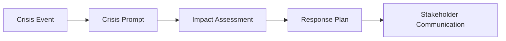
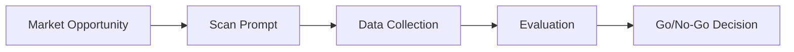

# MCP Prompts Usage Examples

## Overview

This guide provides practical examples of using the TAM MCP Server's business analysis prompts in real-world scenarios.

## Example Workflows

### 1. Startup Investment Analysis

**Scenario**: VC firm evaluating a Series A investment in a FinTech startup

**Steps**:
1. Use `startup-funding-analysis` prompt
2. Gather supporting data with TAM tools
3. Generate investment committee presentation

**Example Usage**:
```typescript
// Get startup analysis prompt
const prompt = await client.request({
  method: "prompts/get",
  params: {
    name: "startup-funding-analysis",
    arguments: {
      company_name: "PaymentCorp",
      funding_stage: "Series A",
      industry: "FinTech",
      funding_amount: "$15M",
      use_of_funds: "Product development and market expansion"
    }
  }
});

// Follow up with market data
const marketData = await client.request({
  method: "tools/call",
  params: {
    name: "tam-calculator",
    arguments: {
      industry: "FinTech",
      geographic_scope: "North America"
    }
  }
});
```

**Output**: Professional investment analysis template including:
- Executive Summary
- Market Size Analysis  
- Competitive Landscape
- Financial Projections
- Risk Assessment
- Investment Recommendation

### 2. Crisis Management Response

**Scenario**: Technology company facing supply chain disruption

**Steps**:
1. Use `crisis-management-analysis` prompt
2. Assess regulatory impact
3. Develop stakeholder communication

**Example Usage**:
```typescript
// Crisis analysis prompt
const crisisPrompt = await client.request({
  method: "prompts/get",
  params: {
    name: "crisis-management-analysis",
    arguments: {
      crisis_type: "Supply chain disruption",
      affected_areas: "Manufacturing, product delivery, customer fulfillment",
      timeline: "Immediate impact, 3-6 month resolution",
      stakeholders: "Customers, suppliers, investors, employees",
      resources_available: "Emergency fund, alternative suppliers, crisis team"
    }
  }
});

// Follow up with economic impact data
const economicData = await client.request({
  method: "tools/call",
  params: {
    name: "fred-economic-series",
    arguments: {
      series_id: "INDPRO"
    }
  }
});
```

### 3. Market Opportunity Assessment

**Scenario**: Corporate development team evaluating international expansion

**Steps**:
1. Use `market-opportunity-scan` prompt
2. Get demographic and economic data
3. Assess competitive landscape

**Example Usage**:
```typescript
// Market opportunity prompt
const opportunityPrompt = await client.request({
  method: "prompts/get",
  params: {
    name: "market-opportunity-scan",
    arguments: {
      market_segment: "SaaS productivity tools",
      geographic_scope: "European Union",
      opportunity_type: "Geographic expansion",
      assessment_urgency: "Q2 strategic planning cycle",
      resource_constraints: "$5M expansion budget"
    }
  }
});

// Get supporting market data
const demographicData = await client.request({
  method: "tools/call",
  params: {
    name: "world-bank-indicators",
    arguments: {
      country: "DEU",
      indicator: "NY.GDP.PCAP.CD"
    }
  }
});
```

## Integration Patterns

### Pattern 1: Prompt → Data → Analysis


**Use Cases**: Investment analysis, market research, strategic planning

### Pattern 2: Crisis → Assess → Respond



**Use Cases**: Crisis management, regulatory response, risk mitigation

### Pattern 3: Opportunity → Evaluate → Decide



**Use Cases**: Business development, expansion planning, product strategy

## Best Practices by Role

### For Investment Professionals

**Recommended Prompts**:
- `startup-funding-analysis`
- `pe-research-analysis`
- `vc-investment-thesis`
- `investment-screening-framework`

**Workflow**:
1. Start with screening framework
2. Use detailed analysis prompts for promising opportunities
3. Gather supporting data with market tools
4. Present with professional templates

**Tips**:
- Include deal size and stage in all analyses
- Use optional parameters for richer context
- Combine prompts with real-time market data

### For Corporate Strategy Teams

**Recommended Prompts**:
- `corporate-strategy-analysis`
- `market-opportunity-scan`
- `competitive-intelligence-brief`
- `international-expansion-analysis`

**Workflow**:
1. Define strategic objective
2. Select appropriate analysis framework
3. Gather market intelligence
4. Develop strategic recommendations

**Tips**:
- Focus on market context and competitive positioning
- Use economic data to support strategic assumptions
- Include timeline and success metrics

### For Crisis Management Teams

**Recommended Prompts**:
- `crisis-management-analysis`
- `regulatory-impact-analysis`
- `technology-disruption-analysis`

**Workflow**:
1. Assess crisis scope and impact
2. Generate response framework
3. Develop stakeholder communications
4. Monitor and adjust response

**Tips**:
- Include all affected stakeholders
- Define clear timelines and resource constraints
- Update analysis as situation evolves

### For Business Development

**Recommended Prompts**:
- `market-opportunity-scan`
- `competitive-intelligence-brief`
- `international-expansion-analysis`

**Workflow**:
1. Identify potential opportunities
2. Conduct rapid market assessment
3. Evaluate competitive landscape
4. Prioritize opportunities

**Tips**:
- Use geographic and market segment filters
- Include resource constraints in analysis
- Combine with demographic and economic data

## Common Integration Scenarios

### Scenario 1: Board Presentation Preparation

**Challenge**: Preparing strategic analysis for board meeting

**Solution**:
```typescript
// Use corporate strategy prompt
const strategyAnalysis = await getPrompt("corporate-strategy-analysis", {
  company_name: "TechCorp",
  strategic_initiative: "AI platform development",
  market_context: "Rapid AI adoption across industries",
  timeline: "18-month development cycle",
  success_metrics: "Market share, revenue growth, customer adoption"
});

// Support with market data
const marketSize = await callTool("tam-calculator", {
  industry: "Artificial Intelligence",
  geographic_scope: "Global"
});
```

### Scenario 2: Due Diligence Support

**Challenge**: Comprehensive investment analysis for PE deal

**Solution**:
```typescript
// Primary analysis
const peAnalysis = await getPrompt("pe-research-analysis", {
  target_company: "ManufacturingCorp",
  industry: "Industrial Manufacturing",
  deal_size: "$250M",
  investment_thesis: "Operational efficiency and market consolidation",
  exit_strategy: "Strategic sale in 5-7 years"
});

// Industry context
const industryData = await callTool("census-county-business-patterns", {
  industry_code: "31-33"
});
```

### Scenario 3: Competitive Intelligence

**Challenge**: Understanding competitive landscape for new product launch

**Solution**:
```typescript
// Competitive analysis
const competitiveAnalysis = await getPrompt("competitive-intelligence-brief", {
  competitor_focus: "Top 3 SaaS competitors",
  analysis_scope: "Product features, pricing, market positioning",
  intelligence_priority: "Product roadmap and go-to-market strategy",
  decision_context: "New product launch planning"
});

// Market positioning data
const marketData = await callTool("alpha-vantage-company-overview", {
  symbol: "CRM"
});
```

## Error Handling and Troubleshooting

### Common Issues

1. **Missing Required Parameters**
```typescript
// ❌ Error - missing required parameter
const prompt = await getPrompt("startup-funding-analysis", {
  company_name: "StartupX"
  // Missing: funding_stage, industry
});

// ✅ Correct - all required parameters
const prompt = await getPrompt("startup-funding-analysis", {
  company_name: "StartupX",
  funding_stage: "Seed",
  industry: "HealthTech"
});
```

2. **Invalid Prompt Names**
```typescript
// ❌ Error - typo in prompt name
const prompt = await getPrompt("startup-funding", {
  // Invalid prompt name
});

// ✅ Correct - exact prompt name
const prompt = await getPrompt("startup-funding-analysis", {
  company_name: "StartupX",
  funding_stage: "Seed",
  industry: "HealthTech"
});
```

3. **Parameter Validation**
```typescript
// ❌ Error - inappropriate parameter value
const prompt = await getPrompt("crisis-management-analysis", {
  crisis_type: "", // Empty string
  affected_areas: "Unknown",
  timeline: "Sometime"
});

// ✅ Correct - specific, actionable parameters
const prompt = await getPrompt("crisis-management-analysis", {
  crisis_type: "Cybersecurity breach",
  affected_areas: "Customer data, payment systems, operations",
  timeline: "Immediate response required, 2-week resolution target"
});
```

## Advanced Usage

### Prompt Chaining

Combine multiple prompts for comprehensive analysis:

```typescript
// 1. Initial opportunity scan
const opportunityScan = await getPrompt("market-opportunity-scan", {
  market_segment: "Electric Vehicles",
  geographic_scope: "North America",
  opportunity_type: "Market entry"
});

// 2. Detailed strategic analysis
const strategyAnalysis = await getPrompt("corporate-strategy-analysis", {
  company_name: "AutoCorp",
  strategic_initiative: "EV market entry",
  market_context: "Rapid EV adoption, regulatory support",
  timeline: "3-year market entry plan"
});

// 3. Competitive intelligence
const competitiveAnalysis = await getPrompt("competitive-intelligence-brief", {
  competitor_focus: "Tesla, GM, Ford EV divisions",
  analysis_scope: "Market share, technology, pricing strategy",
  intelligence_priority: "Competitive positioning opportunities"
});
```

### Dynamic Parameter Generation

Use data from tools to inform prompt parameters:

```typescript
// Get current economic indicators
const gdpData = await callTool("fred-economic-series", {
  series_id: "GDP"
});

// Use economic context in analysis
const crisisAnalysis = await getPrompt("crisis-management-analysis", {
  crisis_type: "Economic downturn",
  affected_areas: "Revenue, customer demand, supply chain",
  timeline: "Current recession indicators suggest 12-18 month impact",
  market_context: `Current GDP: ${gdpData.value}, trend: ${gdpData.trend}`
});
```

## Performance Optimization

### Efficient Prompt Usage

1. **Cache Frequently Used Templates**
```typescript
// Cache common prompt templates
const promptCache = new Map();

async function getCachedPrompt(name, args) {
  const key = `${name}-${JSON.stringify(args)}`;
  if (promptCache.has(key)) {
    return promptCache.get(key);
  }
  
  const prompt = await getPrompt(name, args);
  promptCache.set(key, prompt);
  return prompt;
}
```

2. **Batch Parameter Validation**
```typescript
// Validate all parameters before making requests
function validatePromptParameters(promptName, args) {
  const promptDef = getPromptDefinition(promptName);
  const missingRequired = promptDef.arguments
    .filter(arg => arg.required && !args[arg.name])
    .map(arg => arg.name);
    
  if (missingRequired.length > 0) {
    throw new Error(`Missing required parameters: ${missingRequired.join(', ')}`);
  }
}
```

3. **Parallel Data Collection**
```typescript
// Collect supporting data in parallel
const [promptResult, marketData, competitorData] = await Promise.all([
  getPrompt("competitive-intelligence-brief", params),
  callTool("tam-calculator", marketParams),
  callTool("alpha-vantage-company-overview", competitorParams)
]);
```

## Next Steps

- **Practice**: Try different prompt combinations for your use cases
- **Customize**: Adapt prompt parameters to your specific context
- **Integrate**: Combine prompts with data tools for comprehensive analysis
- **Scale**: Build workflows that leverage multiple prompts and data sources

## Related Documentation

- [MCP Prompts Guide](mcp-prompts-guide.md) - Complete prompt reference
- [Tools Guide](tools-guide.md) - Data collection tools
- [MCP Integration Guide](mcp-integration.md) - Technical setup
- [Examples & Tutorials](examples.md) - Additional examples
