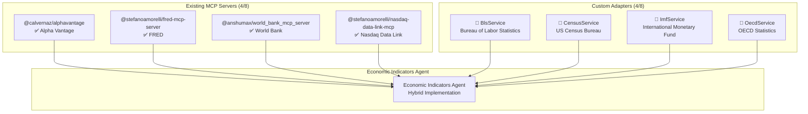
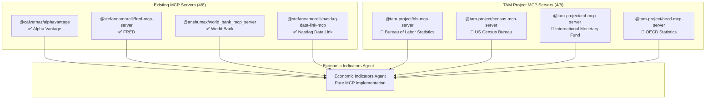

# TAM-MCP-Server: Complete MCP Ecosystem Development Roadmap

## Overview

This roadmap outlines the development of 4 additional MCP servers to achieve 100% MCP integration for all 8 core economic data sources, transitioning from a hybrid approach to a pure MCP ecosystem.

## Current State vs Target State

### Current State: Hybrid MCP/Custom Integration (4/8 MCP Servers)



### Target State: Pure MCP Ecosystem (8/8 MCP Servers)



## Development Timeline

### Phase 0: MCP Server Development (Weeks 1-8)

| Week | MCP Server | Status | Deliverables |
|------|------------|--------|-------------|
| 1-2  | **@tam-project/bls-mcp-server** | 🚀 Development | API v2 integration, employment data series, test suite |
| 3-4  | **@tam-project/census-mcp-server** | 🚀 Development | Economic Census, NAICS codes, market size calculations |
| 5-6  | **@tam-project/imf-mcp-server** | 🚀 Development | SDMX-JSON API, IFS/PCPS/WEO datasets, country indicators |
| 7-8  | **@tam-project/oecd-mcp-server** | 🚀 Development | OECD.Stat integration, dataset search, filtering |

### Phase 1: Integration & Testing (Weeks 9-16)

- Integration of all 8 MCP servers into TAM-MCP-Server
- Update Economic Indicators Agent to pure MCP approach
- Comprehensive testing of all data source integrations
- Performance benchmarking: MCP vs custom adapter approach

### Phase 2: Agent Implementation (Weeks 17-28)

- Complete agent ecosystem with pure MCP integration
- Enhanced Financial Markets Agent with additional MCP servers
- Advanced workflow coordination using all available MCP servers

## Technical Architecture Evolution

### Current: Hybrid Architecture

```python
class EconomicIndicatorsAgent(MCPIntegratedAgent):
    def __init__(self, mcp_clients: Dict[str, MCPClient]):
        super().__init__("economic_indicators_agent", mcp_clients)
        # Mixed approach: 4 MCP servers + 4 custom adapters
        self.required_mcp_servers = [
            "alphavantage", "fred", "world_bank", "nasdaq_data_link"
        ]
        self.custom_data_services = {
            "bls": BlsService(),
            "census": CensusService(), 
            "imf": ImfService(),
            "oecd": OecdService()
        }
```

### Target: Pure MCP Architecture

```python
class EconomicIndicatorsAgent(MCPIntegratedAgent):
    def __init__(self, mcp_clients: Dict[str, MCPClient]):
        super().__init__("economic_indicators_agent", mcp_clients)
        # Pure MCP approach: 8 MCP servers, 0 custom adapters
        self.required_mcp_servers = [
            # Existing MCP servers
            "alphavantage", "fred", "world_bank", "nasdaq_data_link",
            # New TAM Project MCP servers
            "bls", "census", "imf", "oecd",
            # Infrastructure
            "sequential_thinking", "memory"
        ]
        # No custom adapters needed!
        self.custom_data_services = {}
```

## MCP Server Specifications

### 1. @tam-project/bls-mcp-server

**Package**: `bls-mcp-server`  
**Repository**: https://github.com/tam-project/bls-mcp-server  
**NPM**: `@tam-project/bls-mcp-server`

**Core Tools**:
- `bls_get_series_data`: Fetch employment and labor statistics
- `bls_search_series`: Search for BLS data series by keywords  
- `bls_get_popular_series`: Get commonly used BLS series

**Key Features**:
- Full BLS API v2 support with authentication
- Employment, inflation, and productivity data
- Series search and discovery
- Rate limiting and caching

### 2. @tam-project/census-mcp-server

**Package**: `census-mcp-server`  
**Repository**: https://github.com/tam-project/census-mcp-server  
**NPM**: `@tam-project/census-mcp-server`

**Core Tools**:
- `census_get_industry_data`: Fetch industry statistics from Economic Census
- `census_get_market_size`: Calculate market size from census surveys
- `census_search_naics`: Search NAICS industry classification codes

**Key Features**:
- Economic Census and business patterns
- NAICS industry classification support
- Market size calculations
- Geographic data handling

### 3. @tam-project/imf-mcp-server

**Package**: `imf-mcp-server`  
**Repository**: https://github.com/tam-project/imf-mcp-server  
**NPM**: `@tam-project/imf-mcp-server`

**Core Tools**:
- `imf_get_dataset`: Fetch IMF dataset using SDMX-JSON API
- `imf_get_latest_observation`: Get latest observation from IMF dataset
- `imf_search_indicators`: Search available IMF indicators

**Key Features**:
- SDMX-JSON API integration
- Support for IFS, PCPS, WEO, BOP, GFS datasets
- International financial statistics
- Country and indicator code helpers

### 4. @tam-project/oecd-mcp-server

**Package**: `oecd-mcp-server`  
**Repository**: https://github.com/tam-project/oecd-mcp-server  
**NPM**: `@tam-project/oecd-mcp-server`

**Core Tools**:
- `oecd_get_dataset`: Retrieve OECD dataset with filtering
- `oecd_get_latest_observation`: Get latest observation from OECD dataset
- `oecd_search_datasets`: Search available OECD datasets

**Key Features**:
- OECD.Stat database access
- Advanced filtering expressions
- Dataset discovery and metadata
- Cross-country comparative data

## Community Impact

### Open Source Contributions

- **4 new MCP servers** published to npm for community use
- **Standardized economic data access patterns** for other projects
- **Comprehensive documentation** and usage examples
- **Test suites** ensuring reliability and compatibility

### Ecosystem Benefits

- **100% MCP coverage** for major economic data sources
- **Reusable components** for other financial and economic applications
- **Standardized APIs** reducing integration complexity
- **Community-driven maintenance** and improvements

## Success Metrics

### Technical Metrics
- [ ] 8/8 economic data sources use MCP servers (target: 100%)
- [ ] 0 custom adapters required (target: 0)
- [ ] <500ms average response time for data requests
- [ ] >99% uptime for all MCP server integrations

### Community Metrics
- [ ] 4 MCP servers published to npm registry
- [ ] Complete documentation and examples for all servers
- [ ] Community adoption by other projects
- [ ] Contribution to Model Context Protocol ecosystem

### Business Metrics
- [ ] Simplified agent development (pure MCP approach)
- [ ] Reduced maintenance overhead (standardized interfaces)
- [ ] Enhanced reliability (community-tested MCP servers)
- [ ] Future-proof architecture (ecosystem alignment)

---

**Next Steps**: Begin Phase 0 MCP server development, starting with `@tam-project/bls-mcp-server` as the foundation for the pure MCP ecosystem approach.
