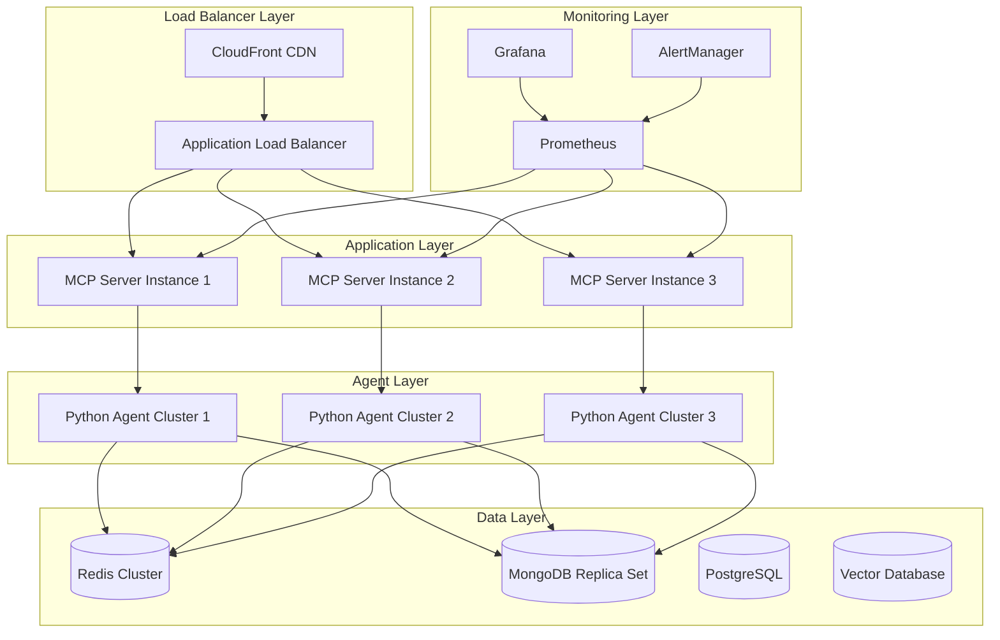

# Deployment Strategy - Infrastructure & Operations Guide

## Overview

This document provides the comprehensive deployment strategy for the TAM-MCP-Server agentic architecture, including infrastructure setup, deployment procedures, and operational guidelines.

## Deployment Architecture

### Production Environment Design



## Infrastructure Requirements

### Kubernetes Cluster Specifications

**Production Cluster**:
- **Node Count**: 6-12 nodes (auto-scaling enabled)
- **Node Types**: 
  - Compute Optimized: For MCP server instances
  - Memory Optimized: For Python agents and data processing
  - Storage Optimized: For databases and caching
- **Resources**:
  - CPU: 64+ vCPU total capacity
  - Memory: 256+ GB total capacity
  - Storage: 2TB+ SSD storage

**Staging Cluster**:
- **Node Count**: 3-6 nodes
- **Resources**: 50% of production capacity
- **Purpose**: Pre-production testing and validation

### Service Resource Allocation

```yaml
# Resource allocation per service
services:
  mcp-server:
    requests:
      cpu: 500m
      memory: 1Gi
    limits:
      cpu: 2000m
      memory: 4Gi
    replicas: 3
    
  python-agents:
    requests:
      cpu: 1000m
      memory: 2Gi
    limits:
      cpu: 4000m
      memory: 8Gi
    replicas: 4
    
  redis:
    requests:
      cpu: 250m
      memory: 512Mi
    limits:
      cpu: 1000m
      memory: 2Gi
    replicas: 3
    
  mongodb:
    requests:
      cpu: 500m
      memory: 1Gi
    limits:
      cpu: 2000m
      memory: 4Gi
    replicas: 3
```

## Deployment Procedures

### 1. Pre-Deployment Checklist

**Infrastructure Validation**:
- [ ] Kubernetes cluster health verified
- [ ] Resource quotas and limits configured
- [ ] Network policies and security groups configured
- [ ] SSL/TLS certificates installed and validated
- [ ] DNS records configured and propagated

**Application Validation**:
- [ ] All container images built and tagged
- [ ] Configuration files and secrets prepared
- [ ] Database migrations tested in staging
- [ ] Integration tests passing in staging environment
- [ ] Performance benchmarks validated

**Monitoring Validation**:
- [ ] Prometheus metrics endpoints configured
- [ ] Grafana dashboards imported and validated
- [ ] Alert rules configured and tested
- [ ] Log aggregation and retention configured

### 2. Deployment Execution

#### Blue-Green Deployment Strategy

```bash
#!/bin/bash
# Blue-Green Deployment Script

# Phase 1: Deploy to Green Environment
echo "Deploying to Green environment..."
kubectl apply -f k8s/green/ --namespace tam-mcp-green

# Phase 2: Health Check Green Environment
echo "Validating Green environment health..."
./scripts/health-check.sh tam-mcp-green

# Phase 3: Switch Traffic (if validation passes)
if [ $? -eq 0 ]; then
    echo "Switching traffic to Green environment..."
    kubectl patch service mcp-server-lb -p '{"spec":{"selector":{"environment":"green"}}}'
    
    # Phase 4: Cleanup Blue Environment
    sleep 300  # Wait 5 minutes for traffic to stabilize
    kubectl delete -f k8s/blue/ --namespace tam-mcp-blue
    
    echo "Deployment completed successfully"
else
    echo "Health check failed, maintaining Blue environment"
    kubectl delete -f k8s/green/ --namespace tam-mcp-green
    exit 1
fi
```

#### Rolling Update Strategy

```yaml
# k8s/mcp-server-deployment.yaml
apiVersion: apps/v1
kind: Deployment
metadata:
  name: mcp-server
spec:
  strategy:
    type: RollingUpdate
    rollingUpdate:
      maxUnavailable: 1
      maxSurge: 1
  template:
    metadata:
      annotations:
        deployment.kubernetes.io/revision: "{{ .Values.revision }}"
    spec:
      containers:
      - name: mcp-server
        image: "{{ .Values.image.repository }}:{{ .Values.image.tag }}"
        readinessProbe:
          httpGet:
            path: /health/ready
            port: 8080
          initialDelaySeconds: 10
          periodSeconds: 5
        livenessProbe:
          httpGet:
            path: /health/live
            port: 8080
          initialDelaySeconds: 30
          periodSeconds: 10
```

## Database Migration Strategy

### MongoDB Migration

```javascript
// migrations/001_initial_agent_schema.js
db.agents.createIndex({ "agent_id": 1 }, { unique: true });
db.agents.createIndex({ "agent_type": 1 });
db.agents.createIndex({ "status": 1 });

db.workflows.createIndex({ "workflow_id": 1 }, { unique: true });
db.workflows.createIndex({ "created_at": 1 });
db.workflows.createIndex({ "status": 1 });

db.agent_memories.createIndex({ "agent_id": 1, "timestamp": -1 });
db.agent_memories.createIndex({ "memory_type": 1 });
```

### Redis Configuration

```redis
# Production Redis Configuration
# redis.conf

# Memory Management
maxmemory 4gb
maxmemory-policy allkeys-lru

# Persistence
save 900 1
save 300 10
save 60 10000

# Clustering
cluster-enabled yes
cluster-config-file nodes.conf
cluster-node-timeout 5000

# Security
requirepass ${REDIS_PASSWORD}
bind 0.0.0.0
protected-mode yes
```

## Monitoring and Alerting Configuration

### Prometheus Configuration

```yaml
# monitoring/prometheus.yml
global:
  scrape_interval: 15s
  evaluation_interval: 15s

rule_files:
  - "alert_rules.yml"

scrape_configs:
  - job_name: 'mcp-server'
    kubernetes_sd_configs:
      - role: endpoints
        namespaces:
          names:
            - tam-mcp
    relabel_configs:
      - source_labels: [__meta_kubernetes_service_name]
        action: keep
        regex: mcp-server

  - job_name: 'python-agents'
    kubernetes_sd_configs:
      - role: endpoints
        namespaces:
          names:
            - tam-mcp
    relabel_configs:
      - source_labels: [__meta_kubernetes_service_name]
        action: keep
        regex: python-agents
```

### Alert Rules

```yaml
# monitoring/alert_rules.yml
groups:
  - name: mcp-server-alerts
    rules:
      - alert: MCPServerDown
        expr: up{job="mcp-server"} == 0
        for: 1m
        labels:
          severity: critical
        annotations:
          summary: "MCP Server is down"
          description: "MCP Server instance {{ $labels.instance }} has been down for more than 1 minute."

      - alert: HighResponseTime
        expr: http_request_duration_seconds{quantile="0.95"} > 1
        for: 5m
        labels:
          severity: warning
        annotations:
          summary: "High response time detected"
          description: "95th percentile response time is {{ $value }}s for {{ $labels.instance }}"

      - alert: AgentWorkflowFailures
        expr: rate(agent_workflow_failures_total[5m]) > 0.1
        for: 2m
        labels:
          severity: critical
        annotations:
          summary: "High agent workflow failure rate"
          description: "Agent workflow failure rate is {{ $value }} per second"
```

## Security Configuration

### Network Policies

```yaml
# security/network-policies.yaml
apiVersion: networking.k8s.io/v1
kind: NetworkPolicy
metadata:
  name: mcp-server-policy
  namespace: tam-mcp
spec:
  podSelector:
    matchLabels:
      app: mcp-server
  policyTypes:
  - Ingress
  - Egress
  ingress:
  - from:
    - namespaceSelector:
        matchLabels:
          name: ingress-nginx
    ports:
    - protocol: TCP
      port: 8080
  egress:
  - to:
    - podSelector:
        matchLabels:
          app: python-agents
    ports:
    - protocol: TCP
      port: 50051  # gRPC
  - to:
    - podSelector:
        matchLabels:
          app: redis
    ports:
    - protocol: TCP
      port: 6379
```

### Secret Management

```yaml
# security/secrets.yaml
apiVersion: v1
kind: Secret
metadata:
  name: api-keys
  namespace: tam-mcp
type: Opaque
data:
  alpha_vantage_key: <base64-encoded-key>
  nasdaq_api_key: <base64-encoded-key>
  openai_api_key: <base64-encoded-key>
  redis_password: <base64-encoded-password>
  mongodb_password: <base64-encoded-password>
```

## Backup and Disaster Recovery

### Backup Strategy

```bash
#!/bin/bash
# backup/backup-script.sh

# MongoDB Backup
mongodump --host mongodb-replica-set \
          --username $MONGO_USER \
          --password $MONGO_PASSWORD \
          --out /backups/mongodb/$(date +%Y%m%d_%H%M%S)

# Redis Backup
redis-cli --rdb /backups/redis/dump_$(date +%Y%m%d_%H%M%S).rdb

# Upload to S3
aws s3 sync /backups/ s3://tam-mcp-backups/$(date +%Y%m%d)/

# Cleanup old backups (keep 30 days)
find /backups/ -type f -mtime +30 -delete
```

### Disaster Recovery Procedures

1. **Data Recovery**:
   - Restore MongoDB from latest backup
   - Restore Redis state from snapshot
   - Verify data integrity

2. **Service Recovery**:
   - Deploy infrastructure from IaC templates
   - Restore application configuration
   - Restart services in dependency order

3. **Validation**:
   - Run health checks on all services
   - Validate agent workflows
   - Test MCP protocol functionality

## Performance Optimization

### Scaling Configuration

```yaml
# autoscaling/hpa.yaml
apiVersion: autoscaling/v2
kind: HorizontalPodAutoscaler
metadata:
  name: mcp-server-hpa
  namespace: tam-mcp
spec:
  scaleTargetRef:
    apiVersion: apps/v1
    kind: Deployment
    name: mcp-server
  minReplicas: 3
  maxReplicas: 10
  metrics:
  - type: Resource
    resource:
      name: cpu
      target:
        type: Utilization
        averageUtilization: 70
  - type: Resource
    resource:
      name: memory
      target:
        type: Utilization
        averageUtilization: 80
```

### Caching Strategy

```typescript
// Cache configuration for optimal performance
const cacheConfig = {
  redis: {
    // Hot data (frequently accessed)
    hot: {
      ttl: 300, // 5 minutes
      maxSize: '1GB'
    },
    // Warm data (moderately accessed)
    warm: {
      ttl: 3600, // 1 hour
      maxSize: '2GB'
    },
    // Cold data (rarely accessed)
    cold: {
      ttl: 86400, // 24 hours
      maxSize: '4GB'
    }
  },
  application: {
    // In-memory cache for extremely frequent data
    maxSize: 100,
    ttl: 60 // 1 minute
  }
};
```

## Operational Procedures

### Health Check Endpoints

```typescript
// Health check implementation
app.get('/health/live', (req, res) => {
  // Basic liveness check
  res.status(200).json({ status: 'alive', timestamp: new Date().toISOString() });
});

app.get('/health/ready', async (req, res) => {
  try {
    // Check Redis connectivity
    await redis.ping();
    
    // Check MongoDB connectivity
    await mongodb.admin().ping();
    
    // Check agent service connectivity
    await grpcClient.healthCheck({});
    
    res.status(200).json({ 
      status: 'ready', 
      timestamp: new Date().toISOString(),
      checks: {
        redis: 'ok',
        mongodb: 'ok',
        agents: 'ok'
      }
    });
  } catch (error) {
    res.status(503).json({ 
      status: 'not ready', 
      error: error.message,
      timestamp: new Date().toISOString()
    });
  }
});
```

### Maintenance Procedures

1. **Regular Maintenance**:
   - Weekly security updates
   - Monthly performance reviews
   - Quarterly disaster recovery tests

2. **Capacity Planning**:
   - Monitor resource utilization trends
   - Plan scaling based on usage patterns
   - Review and adjust resource limits

3. **Performance Monitoring**:
   - Daily performance metric reviews
   - Weekly performance optimization
   - Monthly capacity planning updates

---

This deployment strategy provides a comprehensive foundation for production deployment and operations of the TAM-MCP-Server agentic architecture.
